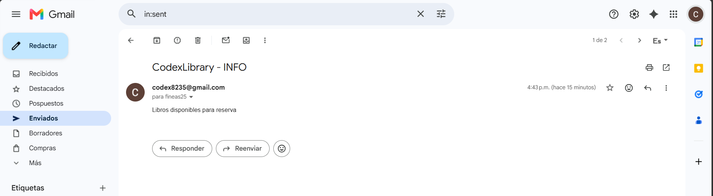

# CodexLibrary - Biblioteca Virtual

CodexLibrary es una aplicacion web para la gestion de una biblioteca virtual. Permite administrar usuarios, libros, autores, categorias, editoriales, prestamos, reservas, multas, resenas, reportes, permisos, auditoria y notificaciones.

El proyecto esta construido con Spring Boot, Thymeleaf, Spring Security, Spring Data JPA y MySQL.

## Funcionalidades principales

- Autenticacion de usuarios con roles.
- Panel administrativo para gestionar el catalogo de la biblioteca.
- Gestion de libros, autores, categorias y editoriales.
- Gestion de prestamos y devoluciones.
- Extension de prestamos y control de prestamos vencidos.
- Gestion de reservas de libros.
- Gestion de multas.
- Apartado de notificaciones para usuarios.
- Envio de notificaciones por correo electronico.
- Reportes y auditoria de acciones.

## Tecnologias usadas

- Java 17
- Spring Boot 4.0.6
- Spring Web
- Spring Security
- Spring Data JPA
- Thymeleaf
- MySQL
- H2 para pruebas/local
- Maven Wrapper

## Requisitos

Antes de ejecutar el proyecto necesitas tener instalado:

- Java 17 o superior
- MySQL Server
- Git, opcional

No necesitas instalar Maven manualmente porque el proyecto incluye Maven Wrapper.

## Base de datos

El proyecto usa por defecto la base de datos MySQL `biblioteca_db`.

Configuracion actual en `src/main/resources/application.properties`:

```properties
spring.datasource.url=jdbc:mysql://localhost:3306/biblioteca_db?useSSL=false&serverTimezone=America/Bogota&allowPublicKeyRetrieval=true
spring.datasource.username=biblioteca_user
spring.datasource.password=biblioteca123
```

Puedes crear la base de datos importando el archivo:

```text
biblioteca_db.sql
```

Ejemplo desde MySQL:

```sql
CREATE DATABASE biblioteca_db;
```

Luego importa el archivo SQL usando MySQL Workbench, phpMyAdmin o consola.

## Ejecucion del proyecto

En Windows, desde la raiz del proyecto:

```powershell
.\mvnw.cmd spring-boot:run
```

En Linux o macOS:

```bash
./mvnw spring-boot:run
```

La aplicacion queda disponible en:

```text
http://localhost:8082
```

## Pruebas

Para ejecutar las pruebas:

```powershell
.\mvnw.cmd test
```

## Notificaciones por correo

El sistema guarda las notificaciones dentro de la aplicacion y tambien puede enviarlas al correo electronico registrado del usuario.

Tipos de notificaciones contempladas:

- Actualizaciones de prestamos.
- Prestamos vencidos.
- Actualizaciones de reservas.
- Nuevos libros disponibles.
- Notificaciones manuales enviadas desde el panel administrativo.

Para activar el envio real de correos se necesita una cuenta SMTP valida. Ejemplo para Gmail:

```properties
codexlibrary.mail.enabled=true
codexlibrary.mail.from=correo-remitente@gmail.com

spring.mail.host=smtp.gmail.com
spring.mail.port=587
spring.mail.username=correo-remitente@gmail.com
spring.mail.password=CONTRASENA_DE_APLICACION
spring.mail.properties.mail.smtp.auth=true
spring.mail.properties.mail.smtp.starttls.enable=true
```

Importante: para Gmail se debe usar una contrasena de aplicacion, no la contrasena normal de la cuenta.

## Seguridad de credenciales

No se recomienda subir contrasenas reales al repositorio. Para produccion o despliegues compartidos, usa variables de entorno o un archivo de configuracion externo.

Ejemplo recomendado:

```properties
codexlibrary.mail.enabled=${CODEXLIBRARY_MAIL_ENABLED:false}
codexlibrary.mail.from=${CODEXLIBRARY_MAIL_FROM:no-reply@codexlibrary.local}
spring.mail.username=${SPRING_MAIL_USERNAME:}
spring.mail.password=${SPRING_MAIL_PASSWORD:}
```

## Estructura general

```text
src/main/java/com/universidad/biblio
├── config        Configuracion de seguridad, auditoria y MVC
├── controller    Controladores web y API REST
├── model         Entidades JPA
├── repository    Repositorios Spring Data JPA
└── service       Logica de negocio

src/main/resources
├── static        Archivos CSS y JavaScript
├── templates     Vistas Thymeleaf
└── application.properties
```

## Empaquetado

El proyecto esta configurado como WAR:

```xml
<packaging>war</packaging>
```

Para generar el artefacto:

```powershell
.\mvnw.cmd clean package
```

El archivo generado queda en `target/`.

## Notas

- El puerto configurado es `8082`.
- La base de datos se actualiza automaticamente con `spring.jpa.hibernate.ddl-auto=update`.
- Si el envio de correo esta desactivado, las notificaciones se seguiran guardando dentro del sistema.

## Envio correo gmail

-Se realizo el envio de un correo a un usuario lector notificandole acerca de libros disponibles para su reserva

## Credenciales correo del proyecto
- Correo codex8235@gmail.com
- Contraseña: codex9999
